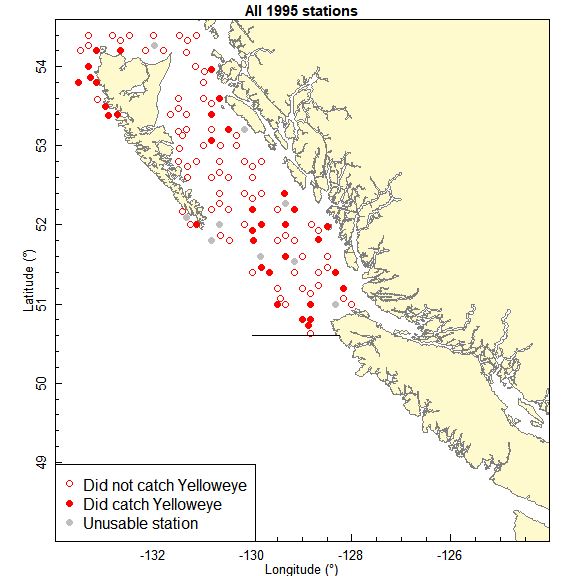

```{r, include = FALSE}
knitr::opts_chunk$set(
  collapse = TRUE,
  comment = "#>",
  fig.width = 6,
  fig.height = 6
)
```

```{r setup}
library(gfiphc)
library(dplyr)
```

<!-- Adapting code written by Andrew Edwards for Beau Doherty at Landmark -->
<!-- Fisheries in March 2019 and updated in September 2019.-->
<!-- Also using MEE_reproduce_2.Rmd vignette from sizeSpectra as a template -->

## Data for all skates and stations, and counts for one species

Extract and save the IPHC data for a single species, using Yelloweye Rockfish as an
example, defined here:

```{r species}
sp <- "yelloweye rockfish"
```

Someone at PBS has to run the first chunk of code to extract data from
the GFBio database and send the external collaborator the resulting four .rds
files. The remaining code will run outside of PBS. Within PBS, the first chunk doesn't need
to be re-run once the .rds files have been saved locally (and so it is not
evaluated here).

```{r extract, eval = FALSE}
# This chunk will only work within PBS
cache_pbs_data_iphc(sp)
                                       # That creates yelloweye-rockfish.rds. [This is
                                       #  what gfsynopsis::get_data_iphc() calls,
                                       #  via gfsynopsis::get_data() in
                                       #  report/make.R of gfsynopsis repo.]

cache_pbs_data_iphc("hook with bait")
                                       # creates hook-with-bait.rds, same as
                                       # sp_set_counts but for 'species' hook
                                       # with bait; needed if looking into hook competition.

saveRDS(get_iphc_sets_info(), "sets-other-years.rds", compress = TRUE)
                                       # extracts the set level data from
                                       #  GFBio for 2003 onwards (excluding 2013)

saveRDS(get_iphc_skates_info(), "skates-other-years.rds", compress = TRUE)
                                       # extracts skate level data from GFBio
                                       #  for 2003 onwards (excluding 2013)
```

Once an external person has the four .rds files, the rest of this code will run
outside of PBS.
```{r loadrds}
sp_set_counts <- readRDS(paste0(gsub(" ", "-", sp), ".rds"))
                                       # For each set, contains the various
                                       # catch rates for this species, the lat
                                       # and lon, and whether the set
                                       # is usable or not. Includes the basic
                                       # information for each set, but further
                                       # details are available in the
                                       # objects described below
hooks_with_bait <- readRDS("hook-with-bait.rds")
sets_other_years <- readRDS("sets-other-years.rds")
skates_other_years <- readRDS("skates-other-years.rds")
```


Other data sets are already built into the gfiphc package, the main ones being:
```{r builtin}
setData1995      # Locations and effective skate values of stations for the 1995 survey
countData1995    # Counts of each species at each station in 1995
data1996to2002   # Catches at each station from 1996 to 2002
setData2013      # Station details for 2013 survey
setDataExpansion # Station details regarding expansion stations from 2018 (and
                 # possibly onwards)
```
See `?<dataset>` for details of each, and `data(package = "gfiphc")` for other
data sets. Notation such as `E_it20` matches the write-up in the Groundfish
Synopsis report.

The formats are different to each other due to the data are
available. For example, there are no `hooksObserved` values available for 1995
and 2013, which will complicate consideration of hook competition
for those years. `setDataExpansion` is needed to identify stations in the expanded
grid (that were not fished in previous years).

Look at the data for the species of interest, which combines all the data for
the species (built-in data sets plus data extracted from GFBio):
```{r load}
sp_set_counts
                  # For each set, the calculatable catch rates for that
                  # species, plus lat and lon and whether the set is usable.
                  # See ?get_all_iphc_set_counts for full details.

tail(sp_set_counts$set_counts)

summary(sp_set_counts$set_counts)

sets_each_year <- sp_set_counts$set_counts %>%
  group_by(year) %>%
  summarise(total = n())
```

## Maps of stations

For a single year, and whether or not the survey caught the species of interest
in that year:

```{r onemap, fig.height = 6}
plot_iphc_map(sp_set_counts$set_counts,
              sp_short_name = "Yelloweye", # for the legend
              years = 2008)
```

Unusable stations are determined by the IPHC and any data are excluded from our
calculations. The horizontal line is the cut-off for calculations for different
Series (see the synopsis Research Document). Note that the `sp_short_name`
argument is only for the legend, the first argument needs to contain the data
for the species of interest.

To see a movie of the station locations through time:

.

Here is the code to build the movie, but it is commented out since it causes Travis
to fail (Travis is the continuous integration service that automatically
checks the packages builds every time a change is committed to GitHub, giving the
little green symbol `passing` icon on the main page). To make the movie, run the
run this vignette code with commented line uncommented (you need to install the
`gifski` package), right-click on the animation in the
html viewer and save it.
```{r, eval=FALSE}
# ```{r, animation.hook = 'gifski', interval = 1.5, fig.height = 6}
for(i in unique(sp_set_counts$set_counts$year)){
  plot_iphc_map(sp_set_counts$set_counts,
                sp_short_name = "Yelloweye",
                years = i)
}
```

To see the stations without reference to any species:
```{r, fig.height = 6}
plot_iphc_map(sp_set_counts$set_counts,
              sp = NULL,
              years = 2008)
```

noting that you still need `sp_set_counts$set_counts` (for an arbitrary species)
as an argument.

Can also use `hooks_with_bait$set_counts` to see stations that came back with no
bait (the legend will need adapting though; empty circles are no baits with
hooks returned):
```{r, fig.height = 6}
plot_iphc_map(hooks_with_bait$set_counts,
              sp = "Hooks with bait",
              years = 2008)
```

In the movie you see that the number of sets jumped in 2018 due to the expanded
survey grid that year that involved extra stations (there should only ever be
one set at a station):
```{r plotsets, fig.height = 4}
plot(sets_each_year$year, sets_each_year$total, type = "o",
     xlab = "Year", ylab = "Sets each year", ylim = c(0, max(sets_each_year$total)))
```

The extra stations are identified as `standard` being `N`, with `Y` being the
standard stations. Removing the non-standard stations brings the number of sets
in 2018 into line with other years, and so this should be done for (most)
analyses:
```{r plotsetsstd, fig.height = 4}
sets_each_year_standard <- sp_set_counts$set_counts %>%
  filter(standard == "Y") %>%
  group_by(year) %>%
  summarise(total = n())

plot(sets_each_year_standard$year, sets_each_year_standard$total, type = "o",
     xlab = "Year", ylab = "Sets each year", ylim = c(0, max(sets_each_year$total)))
```

Note that (as of 2019 data at least) the expansion (non-standard) stations only
appear in 2018:
```{r checkexpansion}
filter(sp_set_counts$set_counts, standard == "N") %>%
  select(year) %>%
  range()
```

So use `filter(..., standard == "Y", usable == "Y")` for analyses (to also include
only the usable stations).

As noted in Issue #14, the standard refinement has not yet been done for the Series A, B, C, D
etc. calculation code that was used for the synopsis report, but the latest
Yelloweye Rockfish assessment did properly account for this.

Also, there are 7 stations for 2018 in GFBio that are not identified yet in
`setDataExpansion` (also noted in Issue #14):
```{r spurious}
summary(sp_set_counts$set_counts$standard)
```
Using `standard == "Y"` will weed these out anyway for now, and this will get
resolved (through Issue #14). Can also check where they are by plotting a map.

## Analyses for full coast

TODO

## Analyses for subset of stations

One application is for generating time series of predators of Haida Gwaii
Pacific Herring, for which we do not want to consider the full coast. The area
of interest is TODO: currently saved in non-pushed files:
```{r predators}
load("herring-predators-HG/AoI.rda")     # Rowan's tidied up file
herring_HG_area <- AoI

plot_BC(main = "All 2008 stations")
PBSmapping::addPolys(herring_HG_area,
                     col = "pink")
plot_iphc_map(sp_set_counts$set_counts,
              sp = NULL,
              years = 2008,
              lat_cut_off = NULL,
              add_to_existing = TRUE)
```

Get data into format needed for PBSmapping findPolys:
```{r format}
# Probably rename this, see what we need. This is to go forwards with EID
# (unique event identifier needed for PBSmapping::findPolys) and in_area
# (whether or not the location is in the area of interest)
sp_set_counts_with_area <- sp_set_counts$set_counts %>%
  dplyr::mutate(in_area = FALSE) %>%       # then adjusted below
  dplyr::bind_cols("EID" = 1:nrow(sp_set_counts$set_counts))

events <- sp_set_counts_with_area %>%
  dplyr::rename(X = lon, Y = lat) %>%
  dplyr::select(year, EID, Y, X)

locData <- PBSmapping::findPolys(as.data.frame(events), herring_HG_area)
EIDs_in_poly <- unique(locData$EID)

sp_set_counts_with_area$in_area <- sp_set_counts_with_area$EID %in% EIDs_in_poly


```


## Not running yet, can ignore for now:

Robyn did this for Pacific Cod (but will not get 2018 right since code doesn't
yet correct for expansion stations). This was to take a quick look at the data,
but she didn't end up using it. Will be useful as an example here.

```{r pcod, eval = FALSE}
iphc_raw <- gfiphc::tidy_iphc_survey(
  get_iphc_hooks("pacific cod"),
  get_iphc_skates_info(),
  get_iphc_sets_info()
)
iphc_index <- gfiphc::calc_iphc_full_res(iphc_raw)
```


The code used in `gfsynopsis/R/make-pages.R` is the following, simplifying it
here to then check that it matches what is done above (not finished checking yet):
```{r gfsynopsis, eval = FALSE}
#if (!is.null(dat_iphc)) {
#    if (!file.exists(iphc_index_cache_spp)) {
      iphc_set_counts_sp <-
        gfiphc::calc_iphc_full_res(dat_iphc$set_counts)

      saveRDS(iphc_set_counts_sp, file = iphc_index_cache_spp, compress = FALSE)
    } else {
      iphc_set_counts_sp <- readRDS(iphc_index_cache_spp)
    }

    iphc_set_counts_sp_format <- tryCatch({
      gfiphc::format_iphc_longest(iphc_set_counts_sp)
    }, error = function(e) NA)
    # Remove existing (GFbio) based IPHC series with longer ones from new calcs
    if (!is.na(iphc_set_counts_sp_format)) {
      dat_tidy_survey_index <- dat_tidy_survey_index %>%
        filter(survey_abbrev != "IPHC FISS") %>%
        rbind(iphc_set_counts_sp_format)
    }
  }
```

## Extracting multiple species (not run here)

Did these for Joe Watson (16/12/20). May as well document here as will need to
do again when the 2020 data are uploaded. Realised can just make a species vector
so doing that here, though not fully tested.

```{r multiple, eval=FALSE}
sp_vec <- c("yelloweye rockfish",
            "arrowtooth flounder",
            "lingcod",
            "north pacific spiny dogfish",
            "pacific cod",
            "pacific halibut",
            "redbanded rockfish",
            "sablefish",
            "longnose skate",
            "walleye pollock")

cache_pbs_data_iphc(sp_vec)   # not double checked, as just ran them all individually

# Do in console to just print the first and last values:
for(sp in sp_vec){
  print(sp)
  print(readRDS(paste0(gsub(" ", "-", sp), ".rds")))
  print(tail(readRDS(paste0(gsub(" ", "-", sp), ".rds"))$set_counts))
}
```
